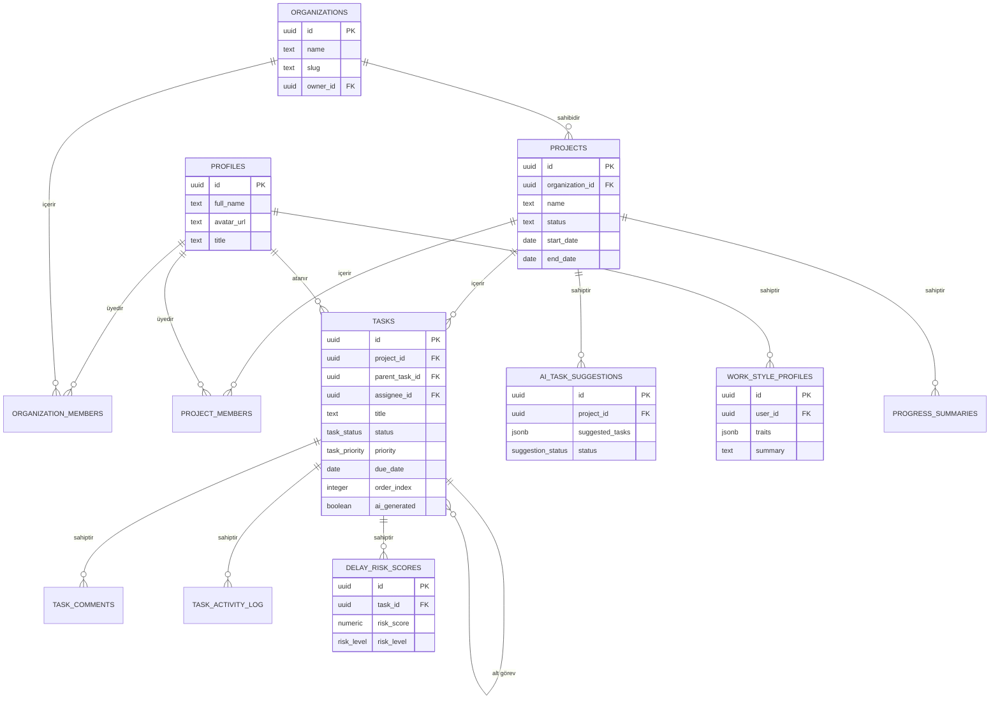

# Vantage — Veritabanı İlişki Diyagramı (ERD)

Bu diyagram implementation_plan.md §4'teki taslağın görselleştirilmiş ve kesinleştirilmiş halidir. Uygulanabilir SQL şeması için: [`../backend/src/db/schema.sql`](../backend/src/db/schema.sql)

