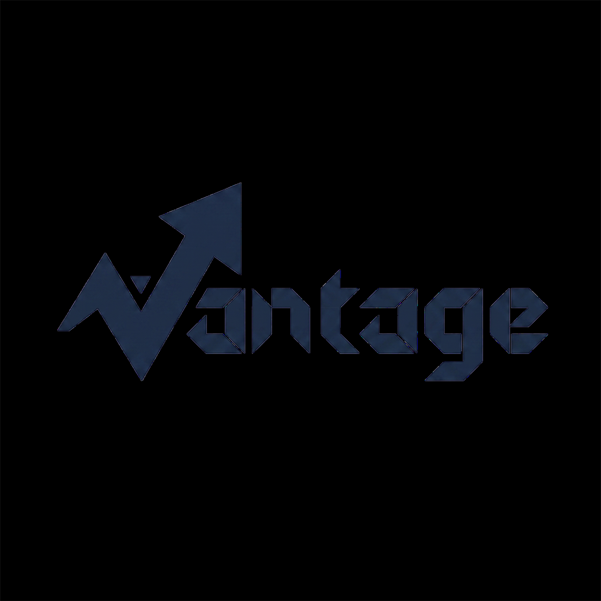
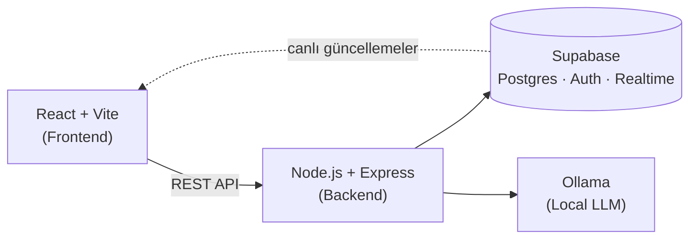

<p align="center"></p>

<h1 align="center">Vantage</h1>
<p align="center"><strong>Yapay Zeka Destekli Proje Yönetim Platformu</strong></p>

<p align="center">
  
  
  
  
  
</p>

Vantage, ekiplerin proje ve görev süreçlerini planlayıp Kanban panosu üzerinden takip edebildiği; buna ek olarak yapay zeka desteğiyle proje açıklamasından otomatik görev üretimi, öncelik/gecikme riski analizi, ekip üyesi çalışma tarzı analizi ve otomatik ilerleme özetleri sunan modüler bir web platformudur.

> Detaylı teknik plan ve 20 günlük takvim için: [implementation_plan.md](./implementation_plan.md)

---

## Neden Vantage?

- **Tek platformda hem planlama hem yürütme** — organizasyon/proje/görev hiyerarşisi, Kanban, deadline ve atama; klasik bir proje yönetimi aracının sunduğu her şey
- **Yapay zeka gerçek bir asistan gibi çalışır** — proje açıklamasını görevlere böler, gecikme riskini önceden haber verir, ekip üyesinin çalışma tarzına göre atama önerir
- **Modüler ve genişletilebilir** — AI katmanı çekirdek platformdan tamamen ayrık; sağlayıcı değişse (local LLM → cloud API) bile geri kalan sistem etkilenmez

## Özellikler

**Çekirdek proje yönetimi**
- Organizasyon / proje / görev hiyerarşisi, rol tabanlı ekip üyeliği
- Kanban panosu üzerinde sürükle-bırak ile durum takibi (canlı senkronizasyon)
- Görevlere atama, öncelik, deadline, etiket
- Proje dashboard'u: durum istatistikleri, geciken görev takibi

**Yapay zeka katmanı**
- **Otomatik görev bölme:** Doğal dilde yazılan proje/özellik açıklaması, önerilen görev listesine dönüştürülür (inceleyip düzenleyerek onaylanır)
- **Önceliklendirme & gecikme riski:** Kural tabanlı risk skoru + LLM tarafından üretilen doğal dil açıklaması
- **Çalışma tarzı analizi:** Ekip üyelerinin görev geçmişine dayalı kişiye özel profil çıkarımı, atama önerilerinde kullanılır
- **Otomatik ilerleme özetleri:** Belirli aralıklarla proje durumunun özetlenmesi

## Mimari



Frontend ve backend birbirinden bağımsız iki uygulama; backend hem Supabase ile hem de local LLM ile konuşan tek katman. AI sağlayıcısı `AIProvider` arayüzü arkasında soyutlandığı için Ollama'nın yerine ileride başka bir sağlayıcı geçebilir.

## Teknoloji Yığını

| Katman | Teknoloji |
|--------|-----------|
| Frontend | React, TypeScript, Vite, TailwindCSS, shadcn/ui, dnd-kit, Recharts |
| Backend | Node.js, Express, TypeScript |
| Veritabanı / Auth / Realtime | Supabase (Postgres) |
| Yapay zeka | Local LLM ([Ollama](https://ollama.com)) — sağlayıcıdan bağımsız `AIProvider` soyutlaması ile |

## Proje Yapısı

```
vantage/
├── frontend/     # React + Vite istemci uygulaması
├── backend/      # Express API + AI orkestrasyonu
├── docs/         # ERD, logo ve ek dokümantasyon
└── implementation_plan.md
```

## Yol Haritası

20 iş günü, 4 haftalık faz halinde ilerliyor. Gün gün detaylar için [implementation_plan.md](./implementation_plan.md).

| Hafta | Odak |
|-------|------|
| 1 | Temel altyapı — auth, proje/görev CRUD, Kanban panosu |
| 2 | Çekirdek proje yönetimi özelliklerinin tamamlanması — roller, dashboard, realtime senkron |
| 3 | AI katmanı — local LLM entegrasyonu, otomatik görev bölme, gecikme riski skoru |
| 4 | İleri AI özellikleri — çalışma tarzı analizi, otomatik ilerleme özetleri, teslim |

## Kurulum

> Bu bölüm, kod iskeleti oluşturuldukça (Gün 2'den itibaren) doldurulacaktır.

## Geliştirme Durumu

Proje aktif geliştirme aşamasındadır. Güncel ilerleme ve gün gün plan için [implementation_plan.md](./implementation_plan.md) dosyasına bakınız.

## Lisans

Bu depo [LICENSE](./LICENSE) dosyasında belirtilen lisans altındadır.
